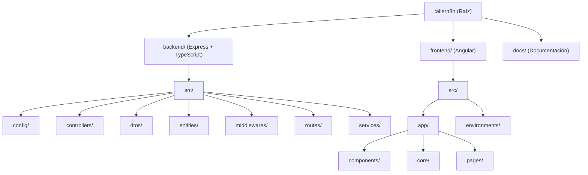
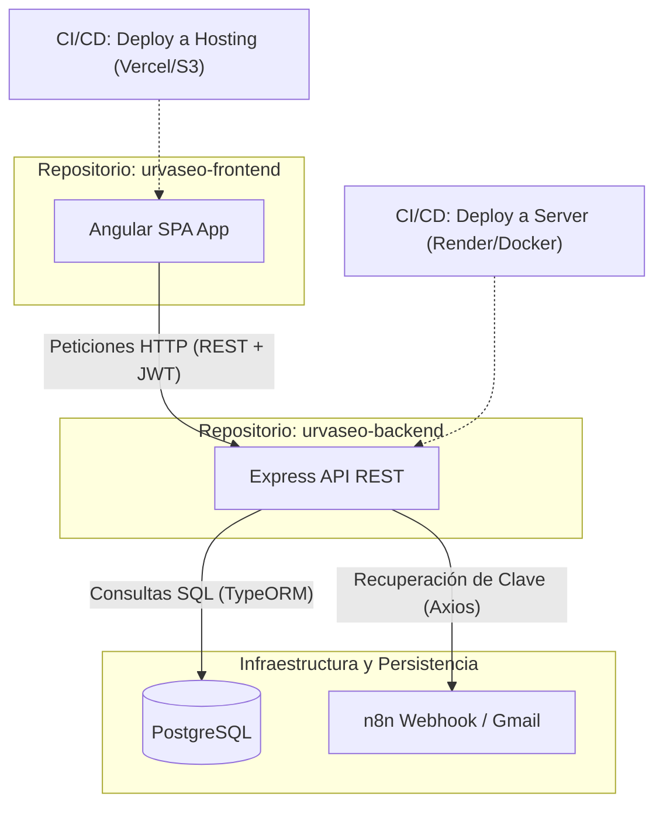

# Portal de Incidencias URVASEO

Este es el repositorio del **Portal de Incidencias URVASEO**, una plataforma para reportar y gestionar incidencias (novedades, proyectos y comentarios).

## Estructura del Proyecto

El proyecto está configurado como un monorepo utilizando **npm workspaces**:



### Distribución de Carpetas

```text
tallern8n/ (Raíz)
├── backend/                  # API REST (Node.js + Express + TypeScript + TypeORM)
│   ├── src/
│   │   ├── config/           # Configuración (Base de Datos, JWT, etc.)
│   │   ├── controllers/      # Controladores de la API
│   │   ├── dtos/             # Data Transfer Objects (Validación)
│   │   ├── entities/         # Entidades de TypeORM (Mapeo a DB)
│   │   ├── middlewares/      # Middlewares (Autenticación, Roles)
│   │   ├── routes/           # Definición de Rutas
│   │   └── services/         # Lógica de Negocio (Servicios)
│   └── tsconfig.json
│
├── frontend/                 # Aplicación SPA (Angular 17+)
│   ├── src/
│   │   ├── app/
│   │   │   ├── components/   # Componentes Reutilizables (Navbar, etc.)
│   │   │   ├── core/         # Servicios de Angular, Guards, Interceptors
│   │   │   └── pages/        # Componentes de Páginas (Login, Dashboard, Chatbot)
│   │   ├── environments/     # Configuración de entornos (API URL)
│   │   └── styles.css        # Estilos Globales (Vanilla CSS)
│   └── angular.json
│

└── docs/                     # Documentación del proyecto (Esquema DB, Estándares)
```

## Posibilidad Futura: Migración a Repositorios Independientes (Multirepo)

Como alternativa de escalabilidad a futuro, el monorepo puede dividirse en **repositorios independientes**. Esto permitiría equipos de desarrollo separados, versionados independientes y ciclos de CI/CD aislados.

### Arquitectura en Multirepo



### Impacto de la separación
* **Independencia de Despliegue:** Cambios en el Frontend no requerirán validar o reconstruir el Backend, y viceversa.
* **Seguridad y Accesos:** Control de accesos más granular en GitHub/GitLab para los desarrolladores.
* **Configuración:** Se eliminarían los npm workspaces; cada repositorio tendría su propio `package.json`, archivo `.env` local e independiente, y configuración de calidad de código (SonarQube) ajustada a su stack.

## Stack Tecnológico

- **Backend:** Node.js, TypeScript, Express, TypeORM, PostgreSQL.
- **Frontend:** Angular, Vanilla CSS, Signals, Standalone Components.
- **Seguridad:** Autenticación basada en JWT, contraseñas hasheadas con bcryptjs.
- **Base de Datos:** PostgreSQL (compartida con la instancia del bot de Telegram, mapeada con TypeORM sin sincronización/recreación de tablas).

## Requisitos Previos

- **Node.js** (v18+)
- **npm** (v9+)
- Contenedor Docker **n8n-postgres** en ejecución.

## Configuración y Desarrollo

1. **Instalar dependencias en el monorepo:**
   ```bash
   npm install
   ```

2. **Configurar el entorno:**
   Configurar las credenciales de base de datos y JWT en el archivo `.env` en la raíz del proyecto.

3. **Ejecutar servicios en desarrollo:**
   - **Backend:**
     ```bash
     npm run dev --workspace=backend
     ```
   - **Frontend:**
     ```bash
     npm run dev --workspace=frontend
     ```
