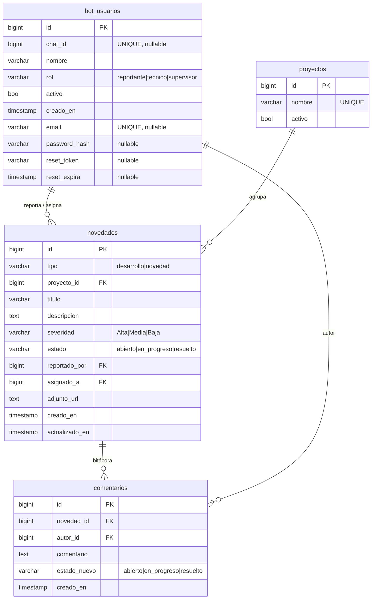

# Esquema de base de datos — Portal de Incidencias URVASEO

> **Fuente de verdad del modelo de datos.** Cualquier tarea de backend debe respetar
> esta estructura. Proviene base existente el portal web solo la mapea con
> TypeORM, **no la recrea**.

## Conexión

- Motor: **PostgreSQL** obtener del .env
- Puerto: **obtener del .env** · Base: **obtener del .env**.
- TypeORM con **`synchronize: false`**. Las tablas ya existen: solo se mapean.
- Los `id` son `int8`/`bigint` → en node-postgres llegan como **`string`** (no perder precisión).
- **Nunca** exponer `password_hash` ni `reset_token` en respuestas de la API.
- Usar parámetros (`$1, $2, …`) en los queries, nunca concatenar valores del usuario.

## Diagrama



## Tablas

### `bot_usuarios` — usuarios del bot de Telegram y del portal web

| Columna         | Tipo           | Reglas                                                                          |
|-----------------|----------------|---------------------------------------------------------------------------------|
| `id`            | `bigint`       | PK                                                                              |
| `chat_id`       | `bigint`       | UNIQUE, nullable (un usuario web puede no tener Telegram)                        |
| `nombre`        | `varchar(120)` | NOT NULL                                                                        |
| `rol`           | `varchar(20)`  | NOT NULL, default `'reportante'`; CHECK IN (`reportante`,`tecnico`,`supervisor`) |
| `activo`        | `bool`         | default `TRUE`                                                                  |
| `creado_en`     | `timestamp`    | default `now()`                                                                 |
| `email`         | `varchar(150)` | UNIQUE, nullable — credencial del login web                                     |
| `password_hash` | `varchar(255)` | nullable — hash bcrypt; nunca devolver en la API                                |
| `reset_token`   | `varchar(255)` | nullable — token temporal de recuperación de contraseña                         |
| `reset_expira`  | `timestamp`    | nullable — expiración del `reset_token` (30 min)                                |

> Las columnas `email`, `password_hash`, `reset_token` y `reset_expira` se agregaron
> al portal web mediante `ALTER TABLE` (extienden la tabla original del Taller 5).

### `proyectos` — catálogo para agrupar incidencias

| Columna  | Tipo           | Reglas           |
|----------|----------------|------------------|
| `id`     | `bigint`       | PK               |
| `nombre` | `varchar(120)` | UNIQUE, NOT NULL |
| `activo` | `bool`         | default `TRUE`   |

### `novedades` — las "incidencias" del portal

| Columna          | Tipo           | Reglas                                                                       |
|------------------|----------------|------------------------------------------------------------------------------|
| `id`             | `bigint`       | PK                                                                           |
| `tipo`           | `varchar(20)`  | NOT NULL; CHECK IN (`desarrollo`,`novedad`)                                  |
| `proyecto_id`    | `bigint`       | FK → `proyectos.id`, nullable                                                |
| `titulo`         | `varchar(200)` | NOT NULL                                                                     |
| `descripcion`    | `text`         | nullable                                                                     |
| `severidad`      | `varchar(10)`  | default `'Media'`; CHECK IN (`Alta`,`Media`,`Baja`)                          |
| `estado`         | `varchar(15)`  | NOT NULL, default `'abierto'`; CHECK IN (`abierto`,`en_progreso`,`resuelto`) |
| `reportado_por`  | `bigint`       | FK → `bot_usuarios.id`, nullable                                             |
| `asignado_a`     | `bigint`       | FK → `bot_usuarios.id`, nullable                                            |
| `adjunto_url`    | `text`         | nullable                                                                     |
| `creado_en`      | `timestamp`    | default `now()`                                                              |
| `actualizado_en` | `timestamp`    | default `now()`                                                              |

### `comentarios` — bitácora; cada cambio de estado deja un registro

| Columna        | Tipo          | Reglas                                                          |
|----------------|---------------|-----------------------------------------------------------------|
| `id`           | `bigint`      | PK                                                              |
| `novedad_id`   | `bigint`      | FK → `novedades.id` **ON DELETE CASCADE**, NOT NULL            |
| `autor_id`     | `bigint`      | FK → `bot_usuarios.id`, nullable                               |
| `comentario`   | `text`        | NOT NULL                                                       |
| `estado_nuevo` | `varchar(15)` | nullable; CHECK IN (`abierto`,`en_progreso`,`resuelto`)        |
| `creado_en`    | `timestamp`   | default `now()`                                                |

## Relaciones (claves foráneas)

| Origen                    | Destino           | Notas          |
|---------------------------|-------------------|----------------|
| `novedades.proyecto_id`   | `proyectos.id`    |                |
| `novedades.reportado_por` | `bot_usuarios.id` |                |
| `novedades.asignado_a`    | `bot_usuarios.id` |                |
| `comentarios.novedad_id`  | `novedades.id`    | `ON DELETE CASCADE` |
| `comentarios.autor_id`    | `bot_usuarios.id` |                |

## Verificar contra la base real

Antes de crear o modificar entidades, confirma el esquema vivo:

```bash
docker exec -it n8n-postgres psql -U n8n_admin -d n8n
```

```sql
\d bot_usuarios
\d proyectos
\d novedades
\d comentarios
```

Si algo difiere de este documento, **gana la base real**: actualiza este archivo.
